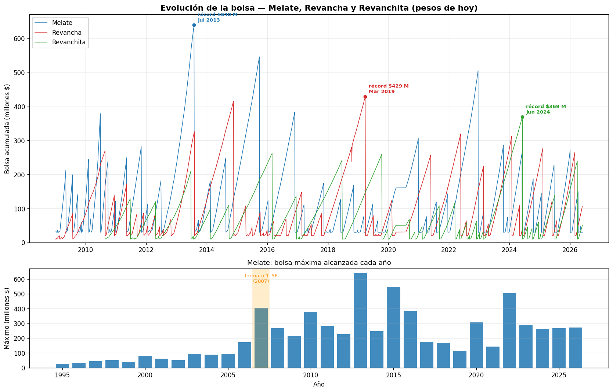
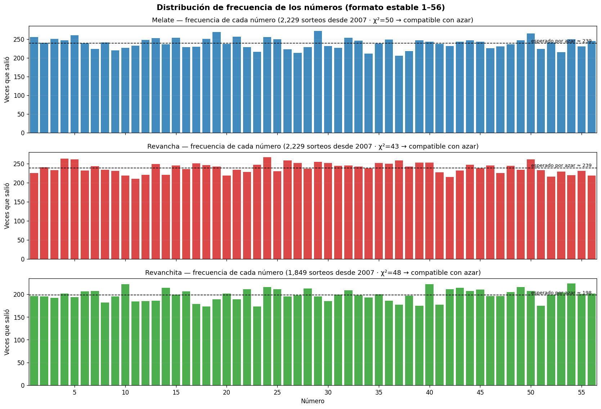
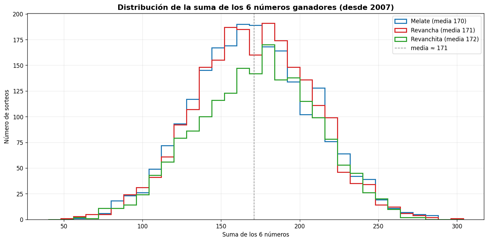
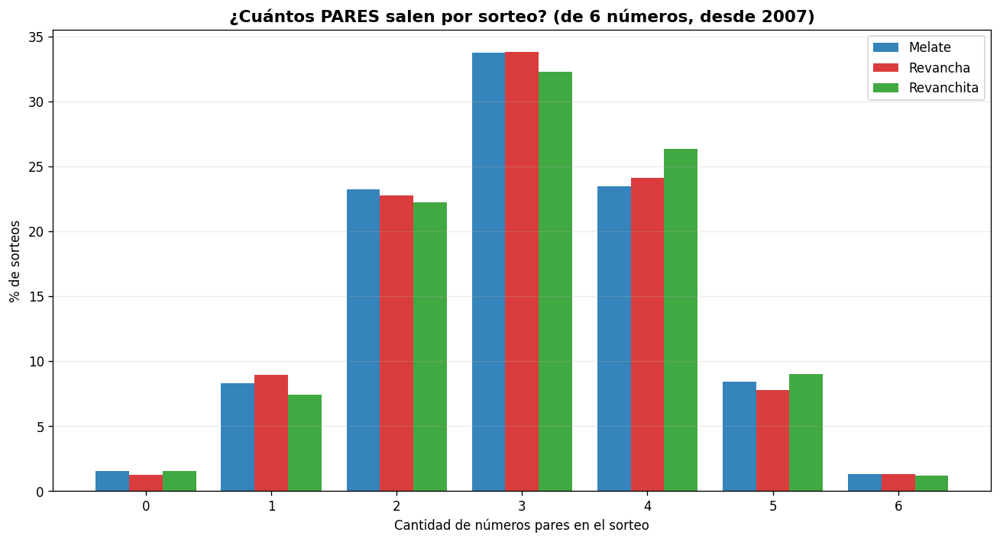
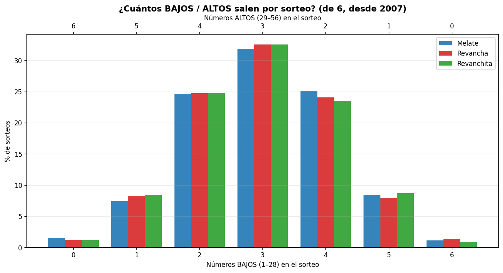

# Análisis de la Lotería Melate 🎲

Análisis estadístico del histórico completo de la lotería mexicana **Melate** y sus
modalidades **Revancha** y **Revanchita** (Pronósticos / Lotería Nacional), con un
script en Python reproducible que genera reportes, gráficos y combinaciones.

> ⚠️ **Aviso.** Proyecto con fines educativos y estadísticos. La lotería es un juego de
> azar: como se demuestra aquí (test χ²), **ningún análisis mejora la probabilidad de
> ganar**. Cada combinación es equiprobable (1 entre 32,468,436). Juega con moderación.

## Contenido

| Archivo | Descripción |
|---|---|
| `analisis_melate.py` | Script principal: reporte + gráfico + generador de combinaciones |
| `Melate.csv` · `Revancha.csv` · `Revanchita.csv` | Histórico de sorteos (1984–2026) |
| `Reporte_Analisis_Melate_2026-05-31.md` | Reporte de ejemplo generado por el script |
| `*.png` | 5 gráficos: evolución de la bolsa, frecuencia de números, distribución de sumas, pares/impares y bajos/altos |
| `requirements.txt` | Dependencias |

## Instalación

```bash
pip install -r requirements.txt
```

Dependencias: `pandas` y `numpy` (obligatorias); `matplotlib` (para `--grafico`);
`scipy` (opcional, añade el p-value del test χ²).

## Uso

```bash
python3 analisis_melate.py                      # sin opciones: muestra la ayuda
python3 analisis_melate.py --reporte            # reporte completo en pantalla
python3 analisis_melate.py -o reporte.md        # guarda el reporte en Markdown
python3 analisis_melate.py --grafico            # genera los 5 gráficos PNG
python3 analisis_melate.py --combinaciones 10   # 10 sextetas que respetan los patrones
python3 analisis_melate.py --reporte --juego Revanchita   # analiza solo un juego
```

El script ordena por concurso y recalcula todo solo: basta con actualizar los CSV con
los sorteos nuevos y volver a ejecutarlo.

## Qué analiza

- **Frecuencias y test de uniformidad (χ²):** demuestra que los tres sorteos son justos.
- **Patrones combinatorios:** distribución de pares/impares, bajos/altos y suma de los 6.
- **Evolución de la bolsa:** récords, tendencia por quinquenio y rachas de acumulación.
- **Generador de combinaciones:** sextetas que respetan los patrones del histórico.

## Hallazgos principales

1. **Los sorteos son estadísticamente justos** (χ² por debajo del valor crítico en los
   tres juegos): no existen números "calientes" ni "fríos" reales.
2. **El formato del Melate cambió 5 veces** (de 1–39 en 1984 a 1–56 desde 2007); por eso
   las frecuencias se calculan solo desde 2007, cuando el rango quedó estable.
3. **Récord de bolsa real:** $639.5 millones (Melate, julio 2013), corregido por la
   reconversión monetaria de 1993.

## Gráficos

El comando `python3 analisis_melate.py --grafico` genera estos cinco gráficos (los de
números, sobre el formato estable 1–56 desde 2007):

**Evolución de la bolsa**



**Frecuencia de cada número** — todas las barras oscilan alrededor del valor esperado por
azar; el χ² confirma que no hay sesgo.



**Distribución de la suma de los 6 números** — campana centrada en ~170.



**Pares/impares y bajos/altos por sorteo** — ambos se concentran en el reparto 3–3.




## Notas sobre los datos

- **Reconversión de 1993:** los concursos ≤ 528 estaban en pesos viejos; se dividen
  entre 1000 para compararlos en pesos de hoy.
- **`BOLSA = 0`** se trata como dato faltante, no como bolsa real.
- **Estructura de los CSV:** `NPRODUCTO, CONCURSO, [6–7 números], BOLSA, FECHA`
  (fecha en formato `dd/mm/aaaa`).

## Licencia

[MIT](LICENSE).
